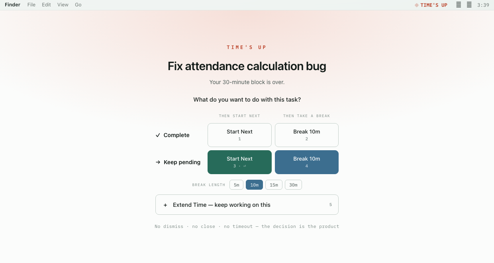
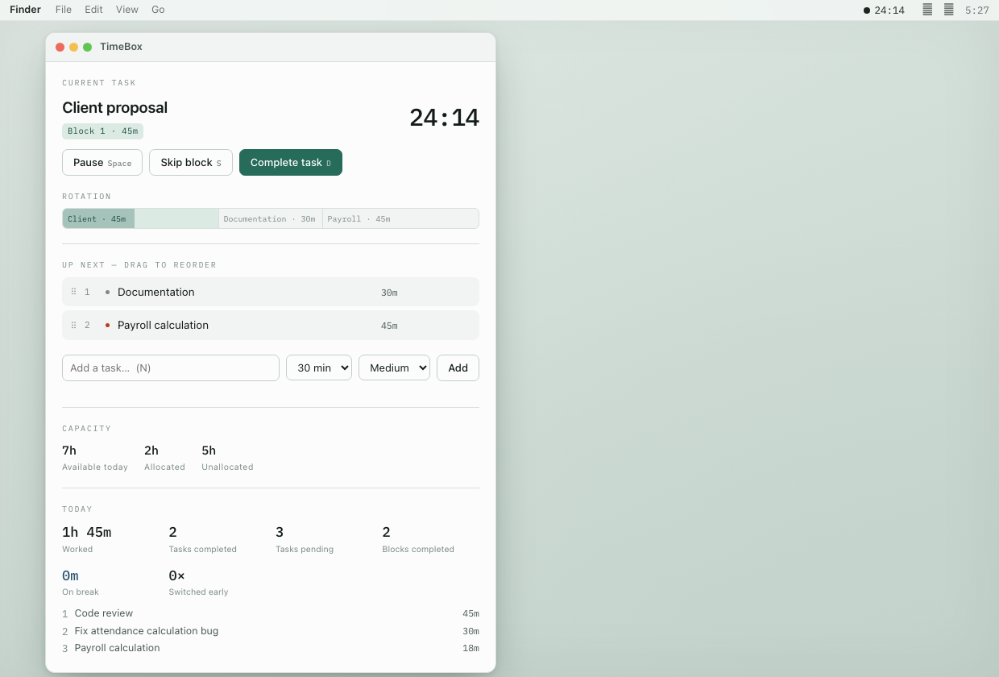
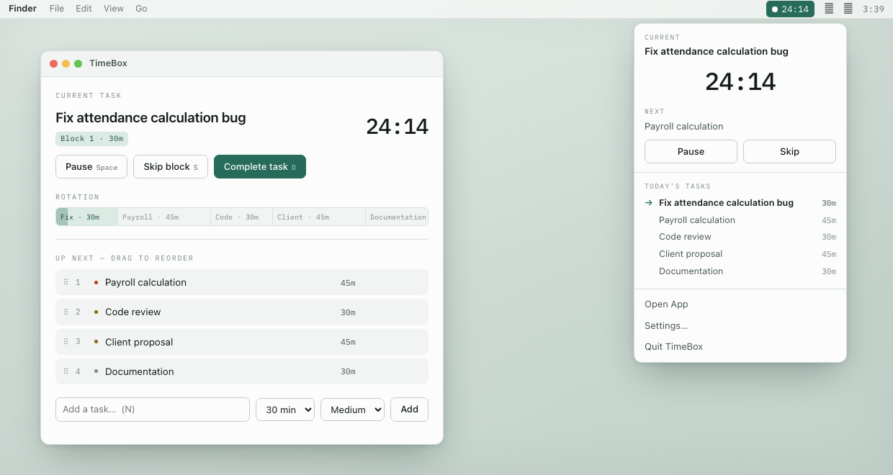
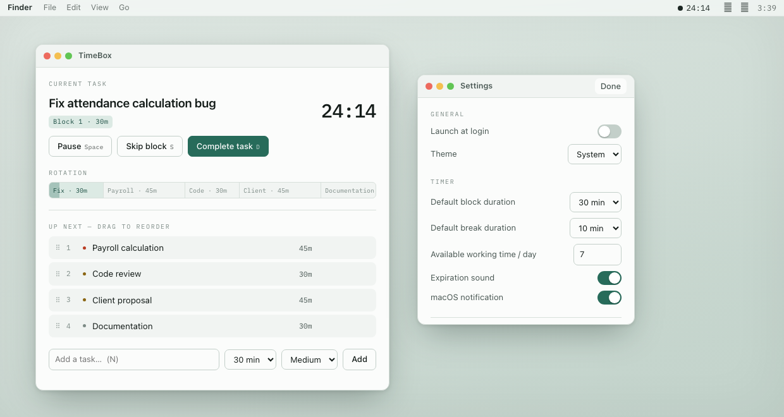

<div align="center">


# TimeBox

**Task rotation timeboxing for macOS.**

A menu bar utility built on one idea:

> The timer controls **how long you work on a task**, not whether the task is completed.



</div>

---

## What that means

Most timers assume the block and the task end together. They don't. You reach
30:00 with the work half-finished, and the app either nags you or silently rolls
on to the next thing.

TimeBox stops. When a block expires it opens a **checkpoint** — a screen-filling
window with no dismiss, no close, no timeout, and no `Esc` — and asks what you
want to do with the task. Finishing the block and finishing the task are
separate decisions, and only you make the second one.

That refusal to auto-advance is the product. Everything else exists to support it.

**This is not a Pomodoro app.** No fixed 25-minute cycles, no automatic breaks,
no streaks to protect. Blocks are per-task and any length you like; breaks are
something you choose at a checkpoint, never something the app imposes.

## The checkpoint

When a work block ends, the task decision is the row and the transition is the verb:

|                   | then start next             | then take a break        |
| ----------------- | --------------------------- | ------------------------ |
| **Complete**      | `✓ Complete & Start Next` `1` | `✓ Complete & Break 10m` `2` |
| **Keep pending**  | `→ Keep Pending & Start Next` `3` `⏎` | `→ Keep Pending & Break 10m` `4` |

Plus `+ Extend Time` `5`. Extending has no break pairing — extending means
staying on this task now.

The checkpoint also tells you what you might otherwise gloss over: how long ago
the block actually ended if you were away, and how much you have already
extended this task today.

## Guarantees

These are enforced in a pure Rust core and covered by tests. They are what the
app *is*, not implementation detail.

- **Block completion ≠ task completion.** A task becomes `Done` only through an
  explicit complete.
- **Switching parks a block, it never re-grants one.** Set a task down at 29:00
  of a 30:00 block and return to it later, and you resume the remaining 1:00 —
  not a fresh 30. Otherwise switching away and back would be an infinite time
  loophole, and no task would ever reach a checkpoint.
- **At most one parked block per task**, enforced in the reducer *and* by a
  unique index in the schema.
- **The checkpoint has no exit.** No dismiss, close, later, or continue. `Esc`
  is inert, `Cmd+W` is refused, and switching tasks is rejected while it is open.
- **Quitting does not stop the clock.** Expiry is an absolute instant, so a
  block keeps consuming its allocation while the app is closed — exactly as it
  does while the Mac sleeps. Only an explicit pause holds a remainder. If
  quitting banked time, quitting would be the loophole.
- **Breaks carry no task**, never count as worked time, and never consume your
  daily capacity.
- **Time at an unanswered checkpoint is surfaced, never guessed at.** It is
  counted as *away* — neither work nor rest — and never back-credited to a task.

## Recovery

Quit mid-block, crash, or close the lid for three days. On launch the app loads
its state and evaluates expiry **before anything renders**, so a block whose time
passed appears as a checkpoint — never as a still-running timer, and never
silently reset. Recorded work is capped at the block's allocation, so a block
reopened days later cannot report days of work.

## Interface

Everything lives in the menu bar; there is no Dock icon and no app-switcher entry.

- **Menu bar** — the <picture><source media="(prefers-color-scheme: dark)" srcset="docs/assets/tray-dark.png"></picture> mark, with the time beside it: `◉ 24:17` while
  working, `◔ BREAK 04:12` on a break, `⚠ TIME'S UP` at a checkpoint
- **Popover** — the whole day is workable from here: current task, countdown,
  next up, pause/skip, and the queue. `Cmd+Shift+T` from anywhere
- **Main window** — rotation strip, drag-to-reorder queue, capacity for the day,
  and a Today summary (worked, on break, away, switched early, top tasks)
- **Settings** — theme, default durations, daily capacity, launch at login,
  sound and notification toggles

Nothing in Settings can switch the checkpoint off. Expiry always requires a decision.

### Keyboard

| Key | Action |
| --- | --- |
| `Space` | Pause / resume |
| `N` | New task |
| `S` | Skip current block |
| `D` | Complete current task |
| `↑` `↓` `⏎` | Move through the queue and switch to a task |
| `Cmd+K` | Quick add |
| `Cmd+,` | Settings |
| `Cmd+Shift+T` | Toggle the popover from any app |

## Screens

<table>
<tr>
<td width="50%"></td>
<td width="50%"></td>
</tr>
<tr>
<td><b>Main window</b> — rotation strip, queue, capacity for the day, and Today</td>
<td><b>Popover</b> — the whole day is workable from the menu bar alone</td>
</tr>
<tr>
<td colspan="2"></td>
</tr>
<tr>
<td colspan="2"><b>Settings</b> — nothing here can switch the checkpoint off</td>
</tr>
</table>

## Install

Requires **macOS 13+**. Apple Silicon and Intel (universal binary).

**[Download TimeBox 0.1.0](https://github.com/gigiheristiawan/timebox/releases/latest)** —
open the DMG and drag TimeBox to Applications. The build is signed with a
Developer ID certificate and notarized by Apple, so it opens without a
Gatekeeper warning.

Or build it from source:

```bash
git clone git@github.com:gigiheristiawan/timebox.git
cd timebox
npm install
npm run tauri:build:universal
```

Then install the result:

```bash
ditto src-tauri/target/universal-apple-darwin/release/bundle/macos/TimeBox.app /Applications/TimeBox.app
open /Applications/TimeBox.app
```

Look for <picture><source media="(prefers-color-scheme: dark)" srcset="docs/assets/tray-dark.png"></picture> in your menu bar — there is no Dock icon by design.

Requires the Rust toolchain and both Apple targets:

```bash
rustup target add aarch64-apple-darwin x86_64-apple-darwin
```

## Privacy

No account, no network calls, no telemetry. Everything is a local SQLite
database at `~/Library/Application Support/xyz.gigiheristiawan.timebox/`.
The web view has no path to it — there is deliberately no SQL plugin.

## Development

```bash
npm run tauri:dev        # run with hot reload on the TypeScript side
npm run typecheck        # tsc --noEmit

cd src-tauri
cargo test                                    # 69 tests
cargo clippy --all-targets -- -D warnings
```

`cargo test` + `cargo clippy` + `npm run typecheck` is the meaningful loop. A
full bundle takes ~90s and proves very little about UI changes.

### Architecture

**Rust owns every decision; TypeScript only formats.**

```
core/        pure reducer, queue ops, menu bar title, Today + capacity   (no I/O)
db/          rusqlite; whole-state snapshot per transaction
state.rs     hydrate, dispatch, the tick thread
platform/    checkpoint, popover, tray, quit-confirm windows
commands.rs  the entire IPC surface
```

`core/` has no I/O, no Tauri imports, and no clock of its own — the instant is
injected, so every product rule is testable at an arbitrary point in time
without a UI. The front end may only send a typed action; anything not in that
enum cannot happen. The countdown interpolates against a backend-supplied
instant and **never concludes expiry itself** — at `00:00` it shows zero and
waits for the backend's transition.

The tick thread parks on a condvar, so idle, paused, and awaiting-decision cost
zero wakeups: **0.00% CPU** and ~55 MB resident when idle.

### Documentation

| | |
| --- | --- |
| [`docs/SPEC.md`](docs/SPEC.md) | Authoritative. Numbered decisions `D1`–`D14` with their reasoning, stack rationale, and acceptance tests |
| [`docs/IMPLEMENTATION_PLAN.md`](docs/IMPLEMENTATION_PLAN.md) | Per-task status across 8 phases |
| [`docs/RELEASE.md`](docs/RELEASE.md) | Build, sign, notarize, staple |
| [`docs/mockup.html`](docs/mockup.html) | Interactive design reference — the real product logic in one HTML file |

Rust test names match the spec's test numbers
(`t14_return_resumes_the_remainder`), so a failing test names the requirement it
broke.

## Status

Phases 1–7 complete; the app is usable for a full working day. Phase 8
(release) is done except for a published, distributable build.

## License

[MIT](LICENSE) © 2026 Gigih Eristiawan
